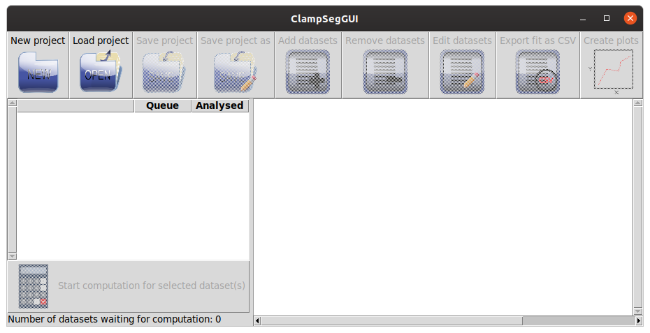
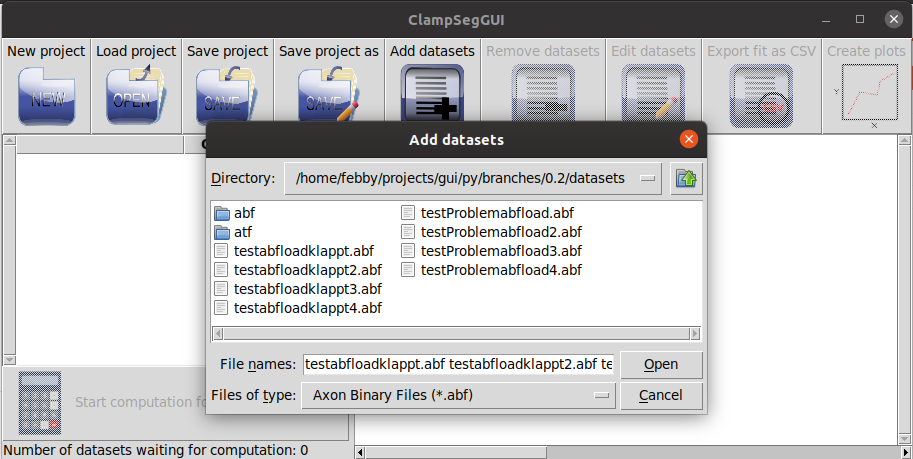
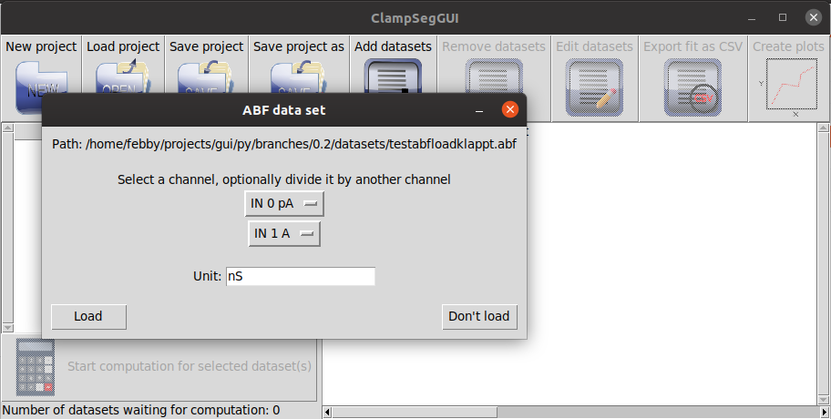
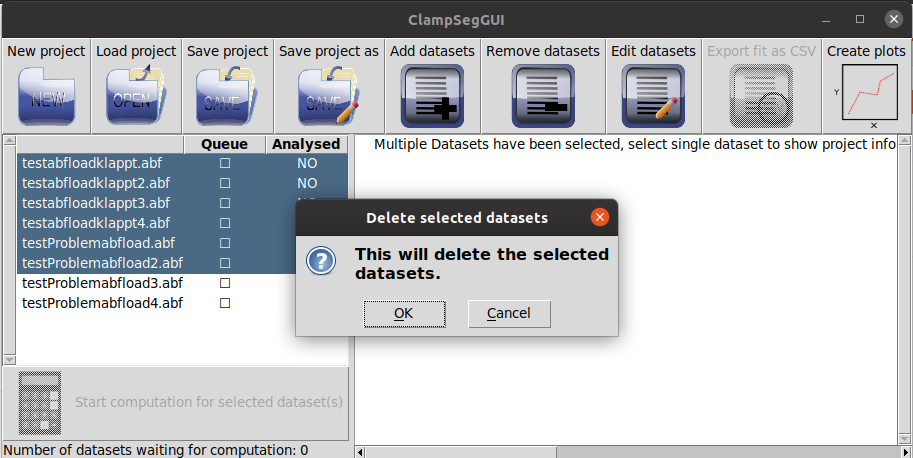
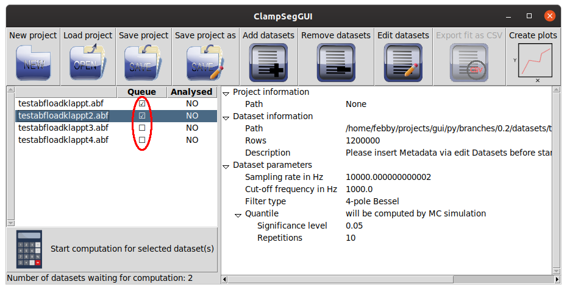
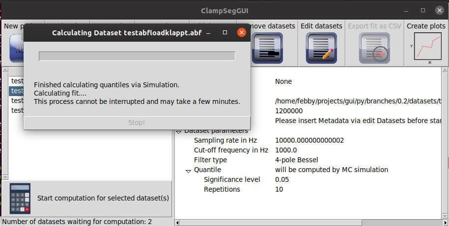
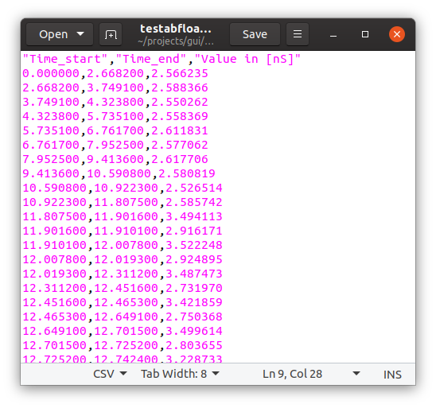

# About this GUI

This graphical user interface allows easy access to the model-free idealization methods in the R-package *clampSeg*, which is available on [CRAN](https://cran.r-project.org/package=clampSeg). Currently, it supports the model-free segmentation method [JULES](https://ieeexplore.ieee.org/document/8374882), which allows a precise idealization of events that are only few data points long by combining a multiresolution criterion and local deconvolution.

# Installation

Please see our [installation guide](installation.md) for how to install clampSegGUI and its dependencies.

# Start

From the top level directory of the program, where `run.pyw` is, run the program:

    python run.pyw

Here, `python` should refer to at least Python 3.5. If there are multiple installations of Python on your system, your command might need to be more specific, e.g. `python3 run.pyw` or `python3.5 run.pyw`.

You should see something like this:



# Projects

To start a new project, click on the *New project* button. To load a previous project click on the *Load project* button.

Assuming you started a new project, it will look something like this:

A click on the *Load project* button will start a filedialog asking you to select the project. The project should have the ending .csg. Note that this filedialog, and most other filedialogs, will freeze the main window for as long as the filedialog is open.

To save your project press the *Save project* or the *Save project as* button. If this project was a new project or you pressed the *Save project as* button, a filedialog will open, asking you to provide a filename.


# Datasets

### Adding and removing datasets

To add one or multiple datasets, click on the *Add datasets* button. This will open a filedialog:

Here you can select one or multiple datasets, with filename extension .atf or .abf. Reading a file with a mislabeled ending, will result in an error.

Clicking on the *Open* button will, after a short wait, open a window asking you to select a channel, optionally divide it by another channel and ask you for the appropriate unit of the result. This window will open for every dataset selected.

To remove datasets, select all datasets you want to remove on the left. Then click on the *Remove dataset* button. A window will open and ask you to confirm. Click *Ok* to remove the selected datasets.



### Viewing and editing metadata

To view the metadata of a dataset, select a single dataset on the left and the metadata will be shown on the right side.


To edit the metadata of a dataset select all datasets for which you want to change the metadata and press the *Edit datasets* button. This will open a new window, where you can input the metadata (explained below). Clicking on *Apply* will set the metadata for all selected datasets.


##### Metadata

Our method requires a correct specification of the used lowpass filter, typically a Bessel filter. So far only Bessel filters are supported. Moreover, a quantile (critical value) for the multiresolution criterion has to be selected to decide between events and noise. The quantile can either be given by the user or be computed by Monte-Carlo (MC) simulations. We strongly recommend to perform Monte-Carlo simulations unless you have good reasons against it. MC simulations and hence the quantile depends on the number of observations and the filter. MC simulations may take a while, depending on the size of the dataset and the number of repetitions it may even last up to a few hours. However, their results are stored and hence they have to be performed only once for each filter type and for each size of the dataset. A recomputation is also required when the number of repetitions is increased. Storing and loading happens in the background. Only at the first time (unless the R package *R.cache* was used before) the user is asked to confirm that a folder is created to store those computations permanently on the disk (they can be deleted at any time). If the user declines it a temporary folder is used and Monte-Carlo simulations have to be computed the next time again. In detail, the following parameters can be chosen:

+ Sampling rate in Hz

  The sampling rate of the dataset. This is read from the input file, but should be checked.

+ Cut-off frequency in Hz

  The cut-off frequency of the lowpass filter. Default value is "NA" and it must be configured before computation is possible.

+ Filter type

  The type of the lowpass filter, currently only Bessel filters with different number of poles are supported. Default value is "NA" and it must be configured before computation is possible.

+ Description

  An option to describe the data set. This is of purely informative character for the user.

+ Provide parameters for quantile simulation / Provide quantile

  Select Provide parameters for quantile simulation if you want to perform MC simulations and Provide quantile if you want to provide the quantile directly. This changes which of the lower parameters are available.

+ Significance level

  A probability (numeric between 0 and 1) giving the significance level of the multiresolution criterion. This parameter provides a tradeoff between the risk of missing true events that are hard to detect and the risk of detecting false positives. The probability of detecting at least one false positive is approximately equal to this parameter. However, larger values allow a better detection of small events.

  By default, we suggest 0.05. If a more rigorous error control is desired, smaller values can be chosen, e.g. 0.01. If important events are hard to detect, the value should be increased, e.g. 0.5.

+ Repetitions

  An integer giving the number of repetitions. We recommend 10,000, the default value, for a thorough analysis that is published, 500-1000 for a quick analysis and 10-100 for a quick try.

+ Quantile

  A numeric giving the quantile.

### Calculating  and exporting fits

Before the calculation of a dataset is possible, the Cut-off frequency and the Filter type have to be specified via *Edit datasets*.

To put datasets into the queue for calculating fits or removing them from the queue click on the empty / filled checkbox on the left in the column *Queue* (marked in red in the following picture). 



If the queue is not empty, click on the button marked *Start computation for selected dataset(s)* to start the computation. This will open a new window informing you that the computation is currently running. Note that this may take a while, depending on the the size of the dataset and the number of repetitions for the Monte-Carlo simulations. All datasets in the queue are computed step by step. For each one the computation starts with Monte-Carlo simulations if required and then with the main calculation.

You can stop the calculation of the quantile by clicking on the *Stop!* button of the window.


The calculation of the fits can currently not be stopped via a button and might take several minutes.



Once the fits are calculated, you can export the fit values as CSV datafiles. To do so, click on the *Export fit as CSV* button. This will open a filedialog for every selected dataset, asking you to specify a filename.


The resulting csv file will have a header as the first line. The data afterwards is comma separated. The file can be opened with a texteditor or with any spreadsheet program.



### Creating plots

To create a plot of the data, select one or multiple datasets and press the *Create plots* button. This will open a new window for every dataset selected. In this window you can click the  *Plot histogram* button to create a histogram plot of the data. If the fit for the dataset has been calculated, it will be in the plot as a red line.


The plot can be saved by clicking on the save icon (marked in blue).

## Reporting issues

Please send bug reports or any other feedback to the developers by emailing `fp366@cam.ac.uk`. Your feedback is highly appreciated.

## Authors

Florian Ebmeier

Stanislav Syekirin

Florian Pein

## Acknowledgements

Support of Deutsche Forschungsgemeinschaft grant SFB 803 Z2 is gratefully acknowledged.

## License

```
    This program is free software: you can redistribute it and/or modify
    it under the terms of the GNU General Public License as published by
    the Free Software Foundation, either version 3 of the License, or
    (at your option) any later version.

    This program is distributed in the hope that it will be useful,
    but WITHOUT ANY WARRANTY; without even the implied warranty of
    MERCHANTABILITY or FITNESS FOR A PARTICULAR PURPOSE.  See the
    GNU General Public License for more details.

    You should have received a copy of the GNU General Public License
    along with this program.  If not, see <https://www.gnu.org/licenses/>.
```
